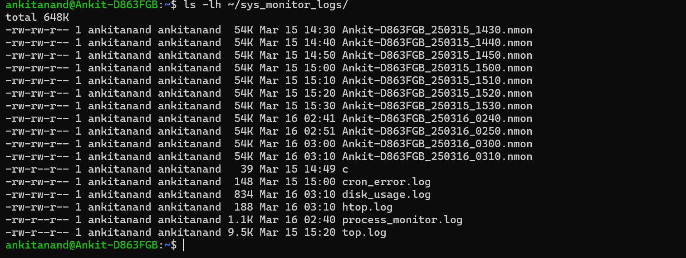

# Graded-Assignment-on-Testing-Linux-and-Servers

# **Task 1: System Monitoring Setup**

## **1️⃣ Install Monitoring Tools**
```bash
sudo apt update && sudo apt upgrade -y
sudo apt install -y htop nmon
```

## **2️⃣ Monitor System Usage**
- `top` → View live CPU, memory, and process usage.
- `htop` → User-friendly system monitor.
- `nmon` → Performance statistics.

## **3️⃣ Check Disk Usage**
```bash
df -h        # Show disk space usage
du -sh /home/*  # Show folder sizes
```

## **4️⃣ Monitor Resource-Intensive Processes**
```bash
ps -eo pid,user,%cpu,%mem,cmd --sort=-%cpu | head -n 10
```

## **5️⃣ Automate Monitoring with Cron Jobs**
### **Create Log Directory:**
```bash
mkdir -p ~/sys_monitor_logs
```
### **Schedule Tasks Every 10 Minutes:**
```bash
crontab -e
```
#### **Add These Lines:**
```bash
*/10 * * * * top -b -n 1 >> ~/sys_monitor_logs/top.log 2>> ~/sys_monitor_logs/cron_error.log
*/10 * * * * script -q -c "htop" ~/sys_monitor_logs/htop.log 2>> ~/sys_monitor_logs/cron_error.log
*/10 * * * * nmon -f -s 10 -c 6 -m ~/sys_monitor_logs/ 2>> ~/sys_monitor_logs/cron_error.log
*/10 * * * * df -h > ~/sys_monitor_logs/disk_usage.log 2>> ~/sys_monitor_logs/cron_error.log
*/10 * * * * ps -eo pid,user,%cpu,%mem,cmd --sort=-%cpu | awk 'NR==1 || $3>0.1' > ~/sys_monitor_logs/process_monitor.log 2>> ~/sys_monitor_logs/cron_error.log
```

## **6️⃣ Verify Logs**
```bash
ls -lh ~/sys_monitor_logs/         # List log files
tail -f ~/sys_monitor_logs/top.log # View live logs
cat ~/sys_monitor_logs/cron_error.log  # Check cron errors
```

## **Troubleshooting**
**Log Files Empty?**
- Use `script -q -c "htop"` instead of `htop -b`.

**Cron Jobs Not Running?**
```bash
grep CRON /var/log/syslog   # Check cron logs
crontab -l                  # Verify cron jobs
```

## **Terminal Result**




**System monitoring is now automated & logging!**


# **Task 2: User Management and Access Control**

### **Objective:**

Set up user accounts and configure secure access controls for new developers.

### **Scenario:**

Two new developers, Sarah and Mike, require system access.

- Each developer needs an isolated working directory to maintain security and confidentiality.
- Security policies must ensure proper password management and access restrictions.

---

## **Steps to Implement:**

### **Step 1: Create User Accounts**

Use the `useradd` command to create user accounts for Sarah and Mike.

```bash
sudo useradd -m -s /home Sarah
sudo useradd -m -s /home Mike
```

- `-m` creates the home directory.
- `-s /bin/bash` sets Bash as their default shell.

### **Step 2: Set Secure Passwords**

Set passwords for both users:

```bash
sudo passwd Sarah
sudo passwd Mike
```

### **Step 3: Create Dedicated Workspaces**

Create separate directories for each user **without using \*\*\*\*\*\*\*\*\*\*\*\*\*\*\*\*****`-p`**:

```bash
sudo mkdir /home/Sarah
sudo mkdir /home/Sarah/workspace

sudo mkdir /home/Mike
sudo mkdir /home/Mike/workspace
```

### **Step 4: Set Ownership and Permissions**

Ensure only the respective users can access their workspace directories:

```bash
sudo chown Sarah:Sarah /home/Sarah/workspace
sudo chown Mike:Mike /home/Mike/workspace

sudo chmod 700 /home/Sarah/workspace
sudo chmod 700 /home/Mike/workspace
```

#### **Explanation:**

- `sudo chown Sarah:Sarah /home/Sarah/workspace`

  - `chown` changes ownership.
  - `Sarah:Sarah` sets both the **owner** and **group** to Sarah.
  - `/home/Sarah/workspace` is the target directory.
  - This ensures only Sarah has control over her workspace.

- `sudo chmod 700 /home/Sarah/workspace`

  - `chmod` sets file/directory permissions.
  - `700` means **only the owner (Sarah) has read, write, and execute permissions**.
  - **No one else (group or others) can access it**.
  - This ensures privacy and security.

The same logic applies to Mike’s workspace.

### **Step 5: Enforce Password Policy**

Install and configure `libpam-pwquality`:

```bash
sudo apt install libpam-pwquality -y
```

Edit the password policy file:

```bash
sudo nano /etc/security/pwquality.conf
```

Modify or add the following lines:

```
minlen = 12
dcredit = -1
ucredit = -1
lcredit = -1
ocredit = -1
```

- **`minlen = 12`** → Minimum password length of 12 characters.
- **`dcredit = -1`** → Requires at least one digit (0-9).
- **`ucredit = -1`** → Requires at least one uppercase letter (A-Z).
- **`lcredit = -1`** → Requires at least one lowercase letter (a-z).
- **`ocredit = -1`** → Requires at least one special character (e.g., @, #, \$).

These settings enforce strong password security.

### **Step 6: Set Password Expiry Policy**

Modify password expiration settings:

```bash
sudo chage -M 30 -m 7 -W 7 Sarah
sudo chage -M 30 -m 7 -W 7 Mike
```

#### **Explanation:**

- `sudo chage -M 30 -m 7 -W 7 Sarah`
  - `-M 30` → Password **expires every 30 days**.
  - `-m 7` → Minimum **7 days before a password change is allowed**.
  - `-W 7` → Warns the user **7 days before password expiration**.

This ensures users regularly update their passwords and get notified in advance.

### **Step 7: Verify Settings**

Check user details:

```bash
sudo ls -ld /home/Mike/workspace
sudo ls -ld /home/Sarah/workspace

sudo chage -l Sarah
sudo chage -l Mike
```

#### **Explanation:**

- `sudo ls -ld /home/Sarah/workspace`
  - `ls` → Lists directory contents.
  - `-l` → Displays detailed (long-format) information, including permissions, owner, group, size, and timestamp.
  - `-d` → Shows information **about the directory itself** rather than its contents.
  - `/home/Sarah/workspace` → The target directory.

**Purpose:**
- It verifies **ownership and permissions** of `/home/Sarah/workspace` without listing its files.
- Helps confirm that only Sarah has access (if `chmod 700` is correctly applied).

- `sudo chage -l Sarah`
  - `chage` is used to **display or modify** password aging information.
  - `-l` lists current settings for **password expiration, minimum days, warning period, and inactivity**.
  - This allows the administrator to check Sarah’s password expiration details.

- `sudo chage -l Mike`
  - Performs the same check for Mike.
  - Ensures that Mike’s password policies are correctly applied.

- `drwx------ 2 Mike Mike 4096 Mar 16 03:34 /home/Mike/workspace`

  - `drwx------` → Directory (`d`), **owner has full permissions (rwx)**, no access for group or others.
  - `2` → Hard link count (typically refers to directories linking to `.` and `..`).
  - `root root` → Owner and group are **both root**.
  - `4096` → Directory size in bytes.
  - `Mar 16 03:34` → Last modification date/time.
  - `/home/Mike/workspace` → The directory path.


